# Procesverslag
Markdown is een simpele manier om HTML te schrijven.  
Markdown cheat cheet: [Hulp bij het schrijven van Markdown](https://github.com/adam-p/markdown-here/wiki/Markdown-Cheatsheet).

Nb. De standaardstructuur en de spartaanse opmaak van de README.md zijn helemaal prima. Het gaat om de inhoud van je procesverslag. Besteedt de tijd voor pracht en praal aan je website.

Nb. Door *open* toe te voegen aan een *details* element kun je deze standaard open zetten. Fijn om dat steeds voor de relevante stuk(ken) te doen.

## Jij

  
uitwerken voor kick-off werkgroep

  ### Auteur:
  Bink Keizer

  #### Je startniveau:
  Rood

  #### Je focus:
  Ik ga mij focussen op responsiveness en als ik tijd over heb ga ik voor surface plane nog wat doen.
 

## Je website

  
uitwerken voor kick-off werkgroep

  ### Je opdracht:
  https://www.fillingpieces.com/?gad_source=1&gclid=EAIaIQobChMIhJyQnZfGggMVmjsGAB0iTwNmEAAYASAAEgJ_mfD_BwE

  #### Screenshot(s) van de eerste pagina (small screen): 
  Home pagina 
  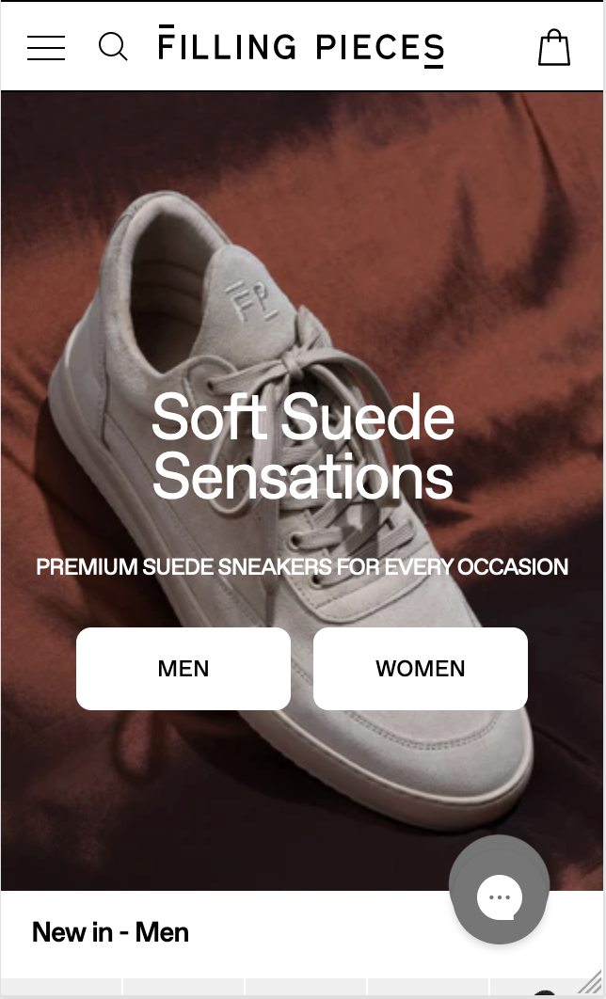

  #### Screenshot(s) van de tweede pagina (small screen):
  Pagina campaigne archief
  
 

## Toegankelijkheidstest 1/2 (week 1)

  
Als site heb ik filling pieces gekozen uiteindelijk. Wat ik vooral merkte
  bij de voice over is dat er links zitten van een menu die onder de foto zit. 
  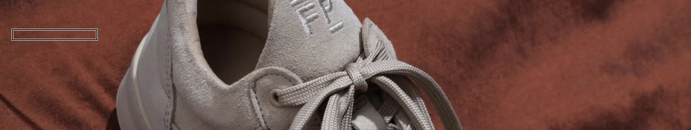 Dit gebeurt ook bij de maten van de kleding op het homescherm. De maten zijn namelijk links. Maar die zie je alleen als je over de image hovert. Dus die leest de screenreader ook allemaal af als je niet hovert. Ook heb je veel pop-ups op de site wat ervoor zorgt dat de screenreader eerst die tekst opneemt.
  e werkgroep

  ### Bevindingen
  Lijst met je bevindingen die in de test naar voren kwamen:

  Links zijn niet helemaal goed gestructureerd met gebruik van de screenreader.
  
  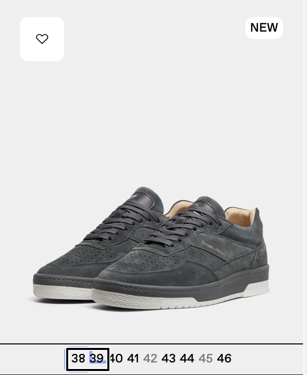

  Er wordt veel gebruik gemaakt van hovers.

  Filling pieces eerst op de pagina knoppen staan van man en vrouw. En daarna hebben ze ook nog een navigatie waarbij je mannen en vrouwen hebt en dan schoenen of kleding kan selecteren als onderwerp.

  Contrast is vaak goed. Wel gebruiken zij plaatjes waar wit in zit en dan gooien zij er witte tekst eroverheen. Dit kan onduidelijk zijn voor slechtziende. 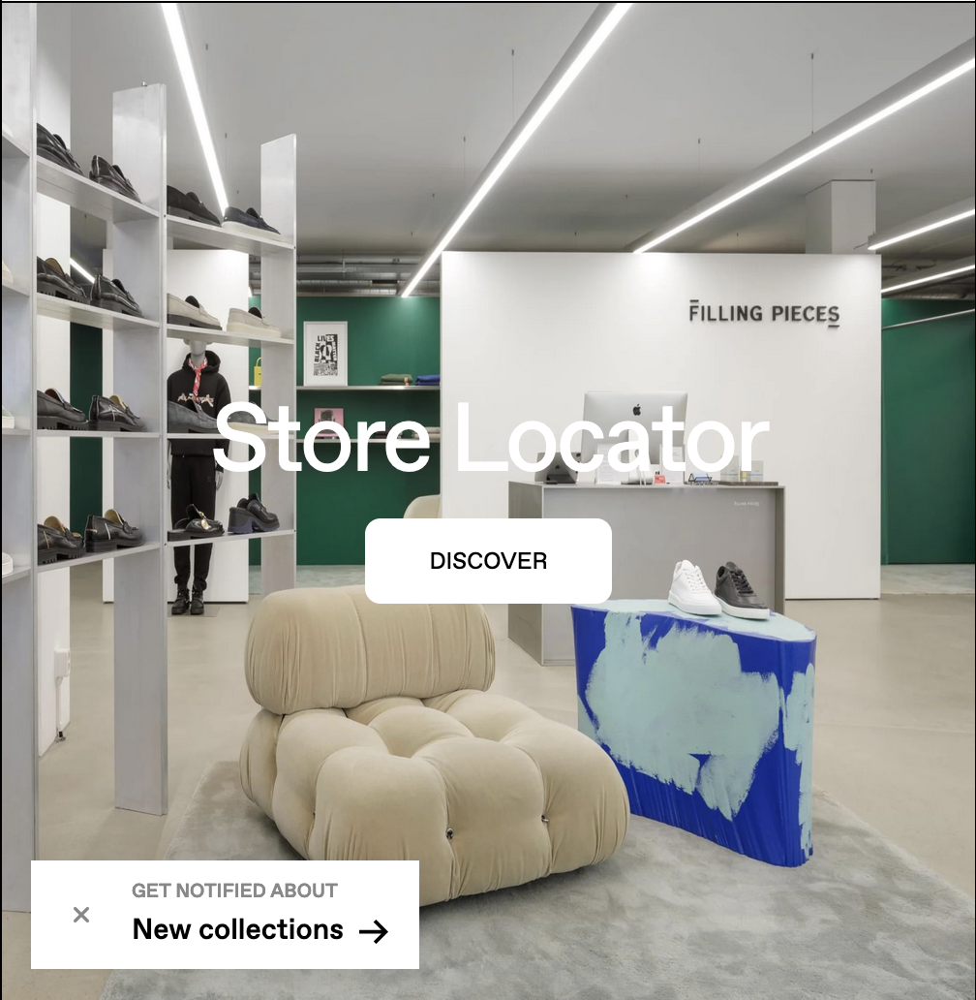

  Filling pieces heeft ook een live chat button toegevoegd. Wat mij opviel is toen ik de website de website naar telefoon deed. Is dat die button soortvan dubbel leek te gaan.  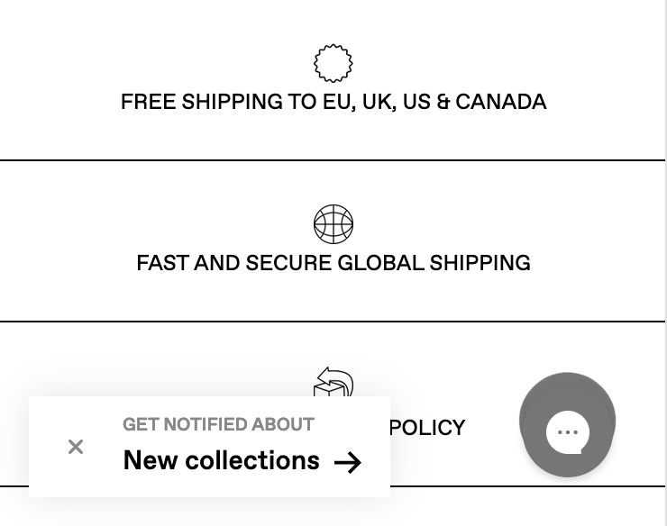

## Breakdownschets (week 1)

  
In week 1 heb ik vooral opdrachten gemaakt die wij in de les moesten maken.
  Verder heb ik geoefend met de screenreader en kwam daar wat dingen tegen die verbeterd kunnen worden voor mijn site.Ook heb ik een breakdownschets gemaakt van de pagina's die ik wil maken. De pagina bestaat uit een header, body en een footer wat logisch is. De header en footer zijn altijd het zelfde behalve als je het op een groot computer scherm toont inplaats van mobiel. Op mobiel is de navigatie namelijk met icons en een hamburger menu gemaakt. En op een computer is het gewoon met tekst. In de homepagina van filling pieces is er veel variatie met afbeeldingen. Eerst beginnen zij met een grote afbeelding daarna met een soort slider. En verder nog 2 afbeeldingen naast elkaar. De kleding wordt vaak gecategoriseerd aan de hand van mannen en vrouwen afdeling.e 

  ### de hele pagina: 
  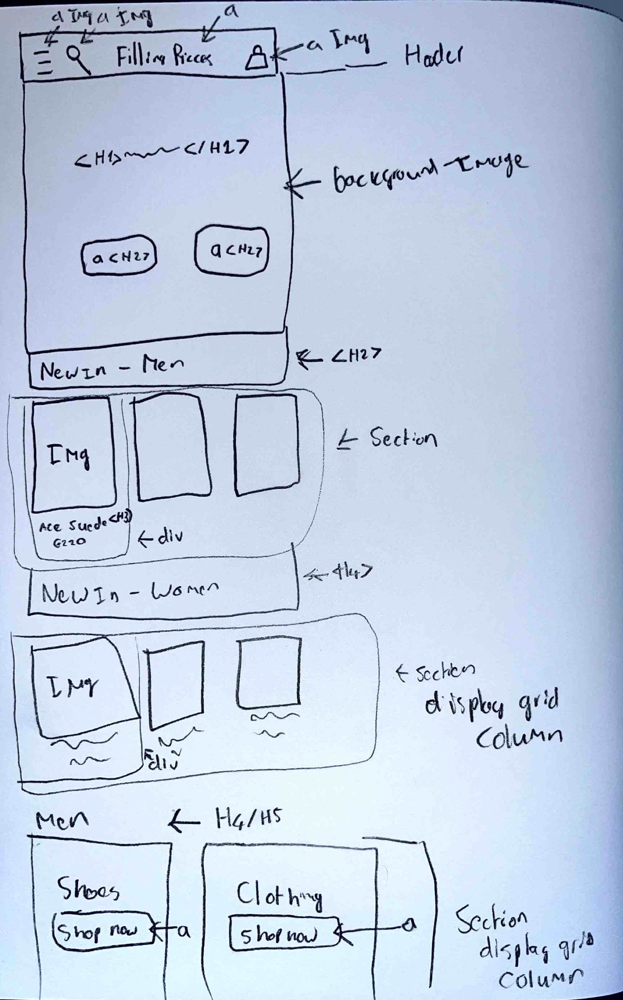

  ### dynamisch deel (bijv menu): 
  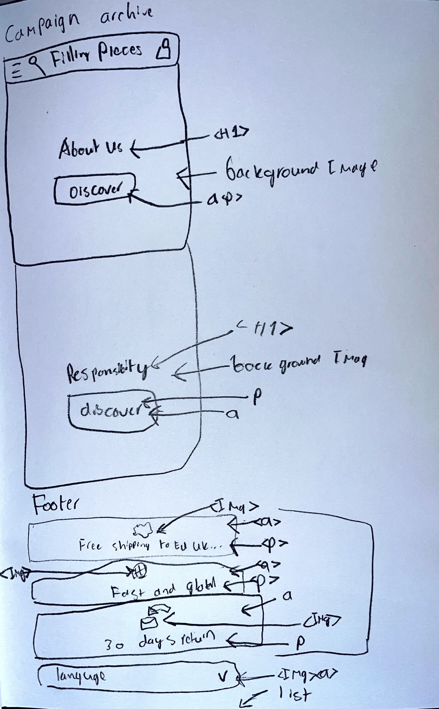

  ### Hoe de footer er nou uitziet op de website: 
  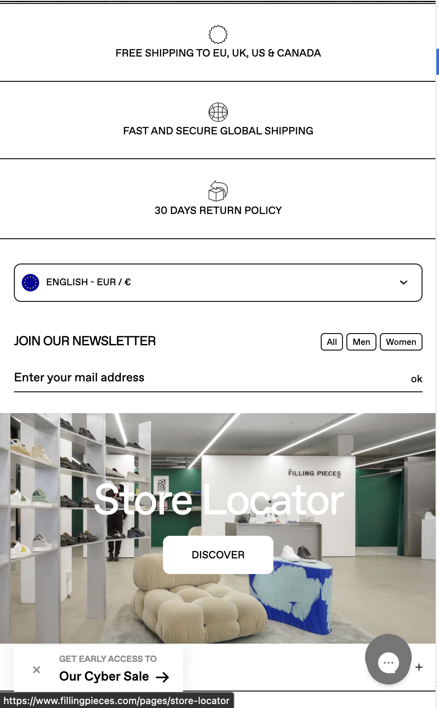

## Voortgang 1 (week 2)

  
uitwerking week 1eIk heb een hover toegevoegd aan mijn navigatiebalk. Ik heb eerst de balk zwart gemaakt. zodat ik het makkelijk kan zien als ik eroverheen hover. Verder heb ik gewerkt aan responsiveness. De website is op dit moment responsive alleen moet ik de navigatiebalk nog regelen. Of met CSS of met javascript nog even kijken hoe ik dat ga doen. Verder heb ik sliders toegevoegd voor de nieuwe producten van vrouwen en mannen. Die ook groter worden zodra je de website op computer laat werken.

  ### Stand van zaken
  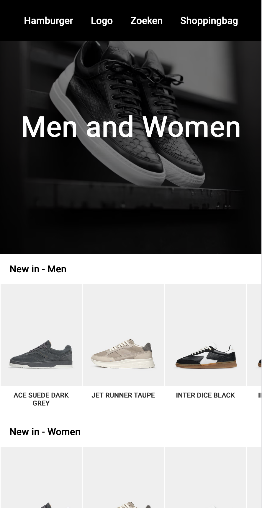
  
  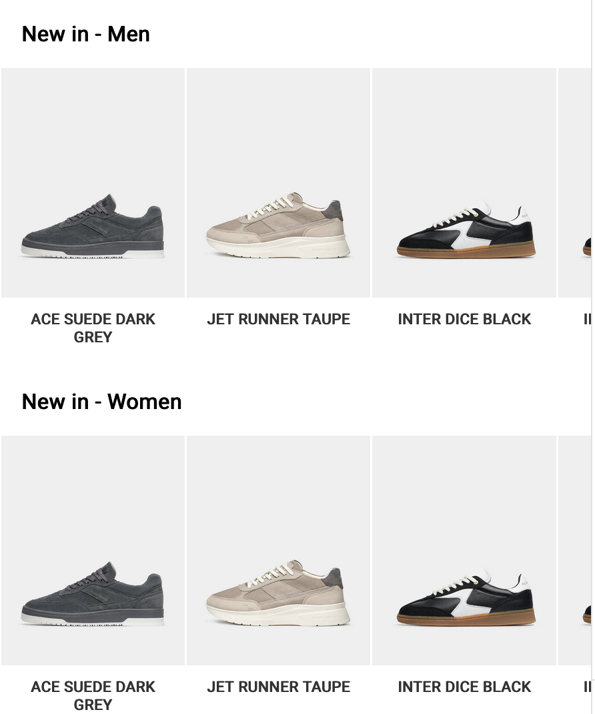
  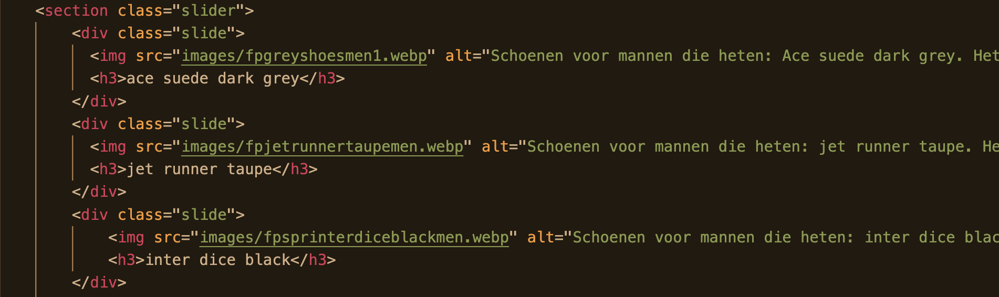
  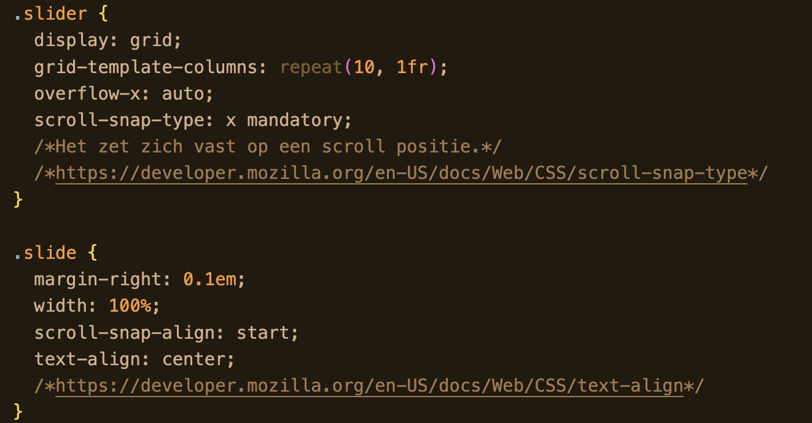
  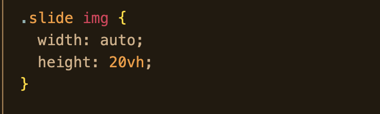
  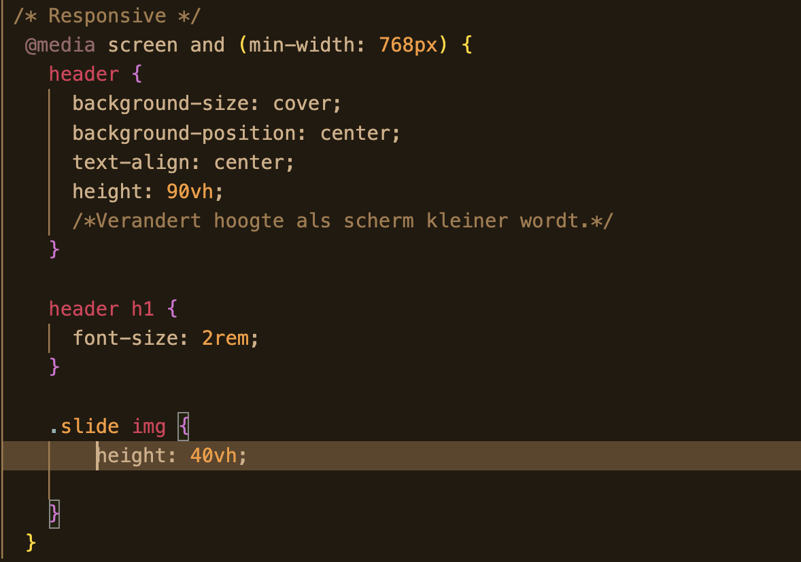
  
Ik heb sliders gemaakt voor de mannen en vrouwen afdeling. Dat zijn alle producten die nieuw zijn op een rijtje. Verder heb ik de slider in een display grid gezet zodat kolommen kon maken. En zo kon ik uiteindelijk de site responsive krijgen door extra code toe te voegen bij een bepaalde grote van de website. Ik heb bij mijn html sections gebruikt en daarin divs gezet. Volgensmij mag je geen divs gebruiken. Maar je kan ook geen section in een section stoppen dus daar moet ik nog een oplossing voor vinden.

  ### Agenda voor meeting
  samen met je groepje opstellen

  | Bink: Divs in sections wat kan je doen ipv dat. | Phon: Button in button/gifs | Silke: Breakdownschets | Mees: Fonts van website | Zoë: detailvraag over uitklappen/ html en css vraag. |

  ### Verslag van meeting
  hier na afloop snel de uitkomsten van de meeting vastleggen
   @font-face Url format (‘woff2’);
 ul> li> items gebruiken voor de plaatjes en h2> daarboven.
 a> tag voor andere pagina en button voor ergens te komen op dezelfde pagina.
label> en input>. Koppelen via een id en for daar zet je dan hetzelfde woord in. Je mag de input ook in de label zetten dan heb je geen id en for nodig.
 Html picture> element reduce gebruiken als je dan aanpast dan komt er een ander plaatje. No-preference is het maakt niet uit. Color-scheme:dark dus aan de hand van de dark mode.
max-width: 100% gebruiken voor responsive.
details>summary>ul>li>/li>/ul>/summary>/details>
-section>h3>button>+/button>ul>/ul>/h3>/section> + tussen de button als je wil uitklappen. JS gebruiken var deButton = document.querySelector(“button”); en dan button.onclik = toggleMenu en dan maak je een functie aan van de toggle menu. En dan maak je een class op je section.

## Voortgang 2 (week 3)

  
Ik heb een nieuwe sectie op de site gezet met de categorieën mannen en vrouwen. Hierin 
  moet ik nog stijlen. Maar ik heb moeite met nth-type selecteren. En hoe ik de derde section kan selecteren.e voortgang

  ### Stand van zaken
  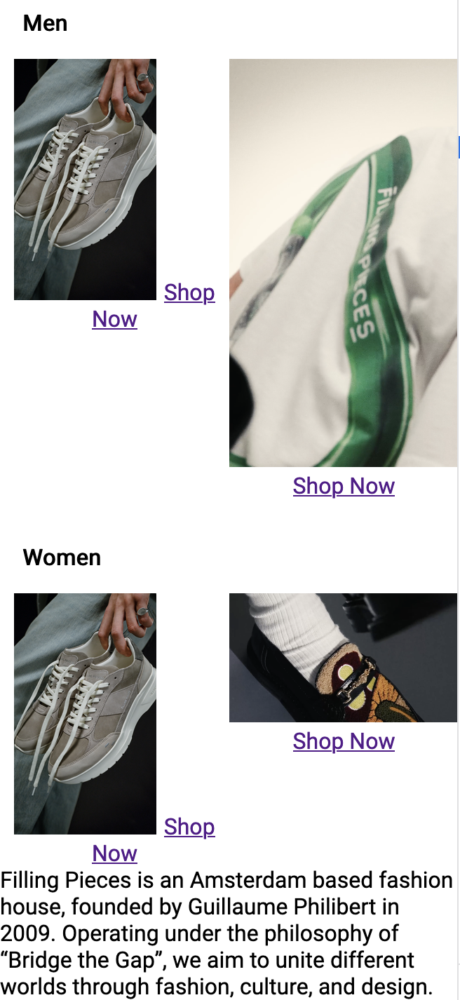

  ### Agenda voor meeting
  samen met je groepje opstellen

  Bink: nth-type/child-type hoe moet ik de derde section selecteren. En de tags daarin. Menubalk maken met javascript en responsive maken ervan.
  Thomas: n.v.t.
  Robin: n.v.t.

  ### Verslag van meeting
  hier na afloop snel de uitkomsten van de meeting vastleggen
 Ik heb een menubalk gemaakt die responsive is. Een hamburger menu bij telefoon die openklapt. En als de site breder wordt dan komt de tekst gewoon in een menubalk te staan.

## Toegankelijkheidstest 2/2 (week 4)

  
 Vergeleken met de filling pieces site is mijn site toegankelijker, omdat het er aria-labels zijn toegevoegd aan knoppen die eigenlijk niet veel zeggen. Ook heb ik een bij een image de contrast aangepast zodat de witte letters erboven op beter te lezen zijn. Verder wordt er geen gebruik gemaakt van divs, maar semantisch correcte code. Dit zorgt ervoor dat de structuur beter in elkaar zit. En de taal die ik in de aria-labels zet omschrijft goed waarvoor een knop bedoelt is. Ook is er een hover, active en focus state bij de buttons.e werkgroep

## Voortgang 3 (week 4)

  
In deze week heb ik vooral gewerkt aan mijn navigatie die is bijna af. Alleen moet ik de letters en iconen 
  nog de goede kleur krijgen. Verder heb ik nog wat dingen op de homepagina gefixt. Alles is nu af behalve de footer en nog een deel van de tweede pagina.e voortgang

  ### Stand van zaken
  Ik vond het lastig om in deze fase iets nieuws in de site toe te voegen. Een deel wordt namelijk al aangepast door de geschreven CSS code. Dus je moet heel goed gaan graven wil je iets goed fixen. Als je dan iets goed krijgt geeft het ook een goed gevoel. Maar het kost wel meer tijd dan aan het begin van de site.

  ### Agenda voor meeting
  samen met je groepje opstellen

  Bink: Footer bespreken met lijnen hoe en wat ik moet doen. Ook het menu als die transparant is dat de letters wit zijn.
  Vraagje over contrast of ik een beetje mag afwijken van de huisstijl daarvoor.
  Thomas: Animatie vraag.

  ### Verslag van meeting
  |automatische padding bij ul moet je dus uitzetten.
  |Je kan background color gebruiken voor streepjes in de footer.
  |Columns verwerken.

## Eindgesprek (week 5)

  
uiteindelijk heb ik twee pagina's gemaakt. Van de website van Filling Pieces. Namelijk de hoofdpagina en de onze wereld pagina. Bij de homepagina ben ik toch wel het trots op de sectie met mannen en vrouwen afdeling. En de tweede pagina zijn vooral filmpjes en foto's die weer naar ergens anders leiden in de echte website.

  ### Je uitkomst - karakteristiek screenshots:
  
  

  ### Dit ging goed/Heb ik geleerd: 
  Het maken van een slider ging heel goed en ik heb het geleerd zonder divs te gebruiken uiteindelijk. Ook heb ik geleerd hoe je nth-of-type moet gebruiken om specifieke tags aan te spreken. Ik ben blij dat ik dat geleerd heb. Verder heb ik display grid/flex beter geleerd en dat is nu makkelijker toe te passen. Wat wel pittig was, maar waar ik wel blij mee ben dat ik het gekozen had is de responsiveness. Bij de navbar had ik wel hulp nodig en je moet dingen in de @media aanspreken als het scherm groter wordt. Alleen wat ik er lastig aan vond was dat je sommige dingen weg moest halen maar wel al aan het begin bij de html moest neerzetten.

  
  
  
  

  ### Dit was lastig/Is niet gelukt:
  Op het einde wou ik mijn navbar in mijn eerste scherm zetten. Maar dit kwam in de knel met de background image die ik heb gebruikt. voor aan het begin van de site. Het lukte mij niet om dit voor elkaar te krijgen dus een deel van de bovenkant van de eerste pagina mist nu. Ook had ik graag bij mijn tweede pagina 2 columns naast elkaar gevoegd als het scherm groter werd dan 60em. Maar helaas kwam ik daar niet aan toe. Als laatst had ik graag mijn footer ook in een grid willen zetten als de site groter werd. Maar dit is ook niet gelukt, omdat het er steeds net niet uitzag hoe ik wou. Daarom heb ik het maar zo gelaten.

  
  
  

## Bronnenlijst

  
continu bijhouden terwijl je werkt

  Nb. Wees specifiek ('css-tricks' als bron is bijv. niet specifiek genoeg). 
  Nb. ChatGpT en andere AI horen er ook bij.
  Nb. Vermeld de bronnen ook in je code.

  1. https://developer.mozilla.org/en-US/docs/Web/CSS/text-align
  2. https://developer.mozilla.org/en-US/docs/Web/CSS/scroll-snap-type
  3. https://blog.hubspot.com/website/z-index#:~:text=What%20is%20z%2Dindex%3F,elements%20along%20the%20z%2Daxis.
  4. https://developer.mozilla.org/en-US/docs/Web/CSS/:nth-of-type
  5. https://stackoverflow.com/questions/45497599/how-to-set-background-image-as-header-with-logo-and-navigation-bar
  6. https://www.handleidinghtml.nl/css/eigenschappen/display/beschrijving.html

