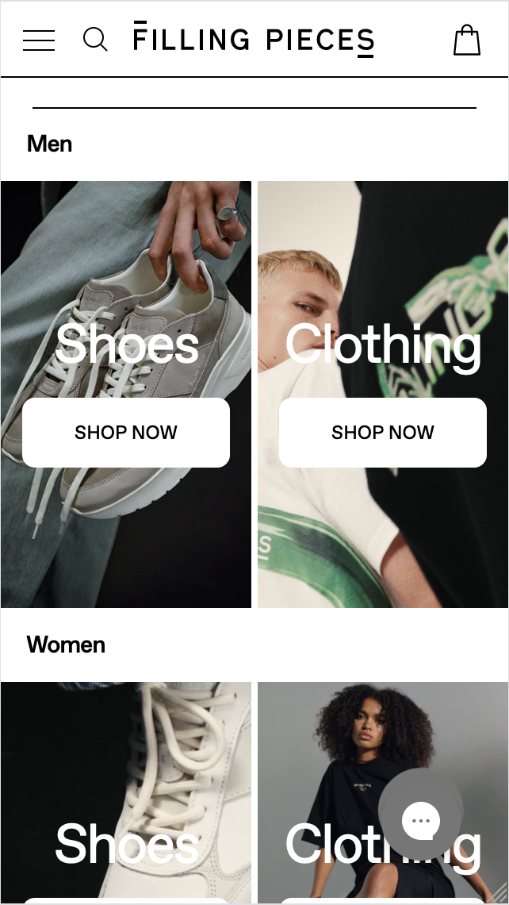
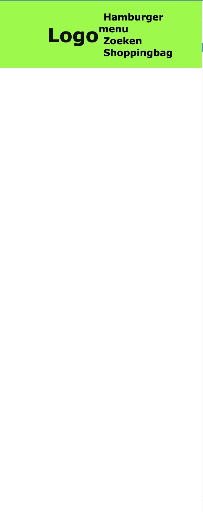

# Procesverslag
Markdown is een simpele manier om HTML te schrijven.  
Markdown cheat cheet: [Hulp bij het schrijven van Markdown](https://github.com/adam-p/markdown-here/wiki/Markdown-Cheatsheet).

Nb. De standaardstructuur en de spartaanse opmaak van de README.md zijn helemaal prima. Het gaat om de inhoud van je procesverslag. Besteedt de tijd voor pracht en praal aan je website.

Nb. Door *open* toe te voegen aan een *details* element kun je deze standaard open zetten. Fijn om dat steeds voor de relevante stuk(ken) te doen.

## Jij

  
uitwerken voor kick-off werkgroep

  ### Auteur:
  Bink Keizer

  #### Je startniveau:
  Rood

  #### Je focus:
  Ik ga mij eerst focussen op surface plane. Als ik dan tijd over heb dan ga ik de website responsive proberen te maken.
 

## Je website

  
uitwerken voor kick-off werkgroep

  ### Je opdracht:
  https://www.fillingpieces.com/?gad_source=1&gclid=EAIaIQobChMIhJyQnZfGggMVmjsGAB0iTwNmEAAYASAAEgJ_mfD_BwE

  #### Screenshot(s) van de eerste pagina (small screen): 
  Home pagina 
  

  #### Screenshot(s) van de tweede pagina (small screen):
  Pagina mannen
  
 

## Toegankelijkheidstest 1/2 (week 1)

  
Als site heb ik filling pieces gekozen uiteindelijk. Wat ik vooral merkte
  bij de voice over is dat er links zitten van een menu die onder de foto zit. 
   Dit gebeurt ook bij de maten van de kleding op het homescherm. De maten zijn namelijk links. Maar die zie je alleen als je over de image hovert. Dus die leest de screenreader ook allemaal af als je niet hovert. Ook heb je veel pop-ups op de site wat ervoor zorgt dat de screenreader eerst die tekst opneemt.
  e werkgroep

  ### Bevindingen
  Lijst met je bevindingen die in de test naar voren kwamen:

  Links zijn niet helemaal goed gestructureerd met gebruik van de screenreader.
  
  

  Er wordt veel gebruik gemaakt van hovers.

  Filling pieces eerst op de pagina knoppen staan van man en vrouw. En daarna hebben ze ook nog een navigatie waarbij je mannen en vrouwen hebt en dan schoenen of kleding kan selecteren als onderwerp.

  Contrast is vaak goed. Wel gebruiken zij plaatjes waar wit in zit en dan gooien zij er witte tekst eroverheen. Dit kan onduidelijk zijn voor slechtziende. 

  Filling pieces heeft ook een live chat button toegevoegd. Wat mij opviel is toen ik de website de website naar telefoon deed. Is dat die button soortvan dubbel leek te gaan.  

## Breakdownschets (week 1)

  
In week 1 heb ik vooral opdrachten gemaakt die wij in de les moesten maken.
  Verder heb ik geoefend met de screenreader en kwam daar wat dingen tegen die verbeterd kunnen worden voor mijn site.Bij mijn site heb ik een navigatiebar proberen te maken hoe mijn site dat ook heeft. De balk lukt wel alleen moet ik kijken hoe ik een hover kan toevoegen aan de balk.e Ik heb thuis de opdrachten gemaakt met het grid. Dit was wel lastiger dan de andere opdrachten vond ik.

  ### de hele pagina: 
  

  ### dynamisch deel (bijv menu): 
  

  ### wellicht nog een dynamisch deel (bijv filter): 
  

## Voortgang 1 (week 2)

  
uitwerking week 1eIk heb een hover toegevoegd aan mijn navigatiebalk. Ik heb eerst de balk zwart gemaakt. zodat ik het makkelijk kan zien als ik eroverheen hover. Verder heb ik gewerkt aan responsiveness. De website is op dit moment responsive alleen moet ik de navigatiebalk nog regelen. Of met CSS of met javascript nog even kijken hoe ik dat ga doen. Verder heb ik sliders toegevoegd voor de nieuwe producten van vrouwen en mannen. Die ook groter worden zodra je de website op computer laat werken.

  ### Stand van zaken
  
  
  
  
  
  
Ik heb sliders gemaakt voor de mannen en vrouwen afdeling. Dat zijn alle producten die nieuw zijn op een rijtje. Verder heb ik de slider in een display grid gezet zodat kolommen kon maken. En zo kon ik uiteindelijk de site responsive krijgen door extra code toe te voegen bij een bepaalde grote van de website. Ik heb bij mijn html sections gebruikt en daarin divs gezet. Volgensmij mag je geen divs gebruiken. Maar je kan ook geen section in een section stoppen dus daar moet ik nog een oplossing voor vinden.

  ### Agenda voor meeting
  samen met je groepje opstellen

  | student 1      | student 2          | student 3    | student 4        |
  | ---            | ---                | ---          | ---              |
  | dit bespreken  | en dit             | en ik dit    | en dan ik dat    |
  | en dat ook nog | dit als er tijd is | nog een punt | dit wil ik zeker |
  | ...            | ...                | ...          | ...              |

  ### Verslag van meeting
  hier na afloop snel de uitkomsten van de meeting vastleggen

  - punt 1
  - punt 2
  - nog een punt
  - ...

## Voortgang 2 (week 3)

  
uitwerken voor 2e voortgang

  ### Stand van zaken
  hier dit ging goed & dit was lastig (neem ook screenshots op van delen van je website en code)

  ### Agenda voor meeting
  samen met je groepje opstellen

  | student 1      | student 2          | student 3    | student 4        |
  | ---            | ---                | ---          | ---              |
  | dit bespreken  | en dit             | en ik dit    | en dan ik dat    |
  | en dat ook nog | dit als er tijd is | nog een punt | dit wil ik zeker |
  | ...            | ...                | ...          | ...              |

  ### Verslag van meeting
  hier na afloop snel de uitkomsten van de meeting vastleggen

  - punt 1
  - punt 2
  - nog een punt
- ...

## Toegankelijkheidstest 2/2 (week 4)

  
uitwerken na test in 9e werkgroep

  ### Bevindingen
  Lijst met je bevindingen die in de test naar voren kwamen (geef ook aan wat er verbeterd is):

## Voortgang 3 (week 4)

  
uitwerken voor 3e voortgang

  ### Stand van zaken
  hier dit ging goed & dit was lastig (neem ook screenshots op van delen van je website en code)

  ### Agenda voor meeting
  samen met je groepje opstellen

  | student 1      | student 2          | student 3    | student 4        |
  | ---            | ---                | ---          | ---              |
  | dit bespreken  | en dit             | en ik dit    | en dan ik dat    |
  | en dat ook nog | dit als er tijd is | nog een punt | dit wil ik zeker |
  | ...            | ...                | ...          | ...              |

  ### Verslag van meeting
  hier na afloop snel de uitkomsten van de meeting vastleggen

  - punt 1
  - punt 2
  - nog een punt
  - ...

## Eindgesprek (week 5)

  
uitwerken voor eindgesprek

  ### Je uitkomst - karakteristiek screenshots:
  

  ### Dit ging goed/Heb ik geleerd: 
  Korte omschrijving met plaatjes

  

  ### Dit was lastig/Is niet gelukt:
  Korte omschrijving met plaatjes

  

## Bronnenlijst

  
continu bijhouden terwijl je werkt

  Nb. Wees specifiek ('css-tricks' als bron is bijv. niet specifiek genoeg). 
  Nb. ChatGpT en andere AI horen er ook bij.
  Nb. Vermeld de bronnen ook in je code.

  1. bron 1
  2. bron 2
  3. ...

